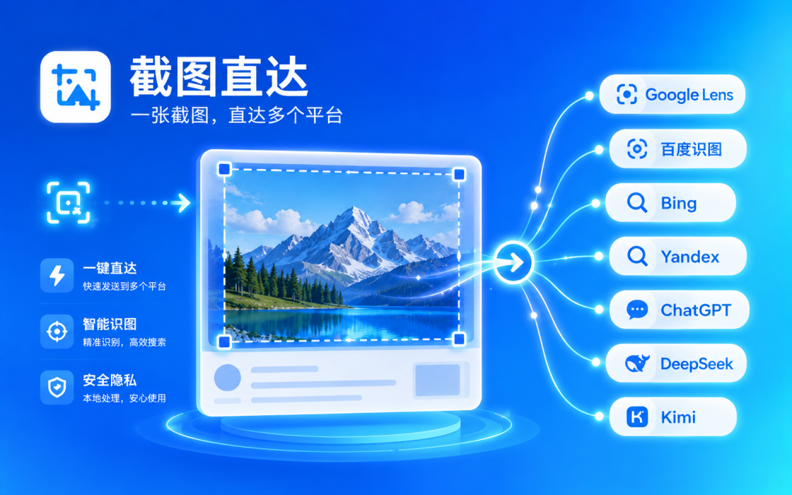
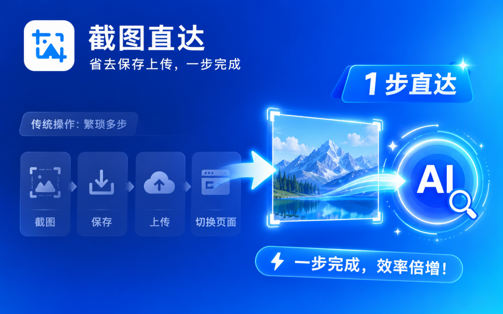
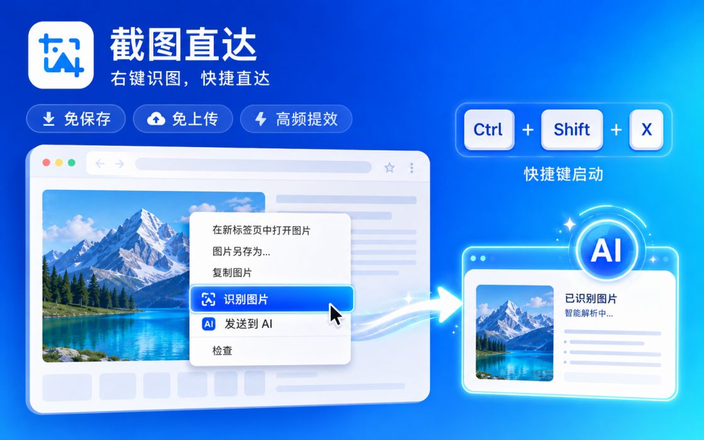

# 截图直达`r`n`r`n`r`n`r`n## 老司机必备插件：一键截图识图，懂的都懂。`r`n`r`n> 看到图先截一手，识图、问 AI 都能接。`r`n`r`n截图直达是一款主打“快速截图识图 + 一键发送到 AI”的效率工具扩展，帮助用户减少繁琐操作，把“截图、保存、上传、切换页面”的多步流程缩短成一步。

## 概述

你是否经常遇到这些问题：

- 看到一张图，想立刻搜来源、找同款、查原图，却要先截图、保存，再打开搜图网站上传
- 想把截图发给 AI 识别、解释、翻译或分析，却要反复切换页面、手动上传附件
- 网页上一张图片想直接识别，却没有方便的右键入口
- 不同场景下要在 Google、百度、Bing、Yandex、ChatGPT、DeepSeek、Kimi 之间来回切换，操作重复又费时

截图直达的目标就是把这些重复步骤压缩到最短，让你实现“看到即搜、截完即问、一步直达”。

## 核心能力

- 框选截图后立即处理  
  在网页中直接框选任意区域，截图完成后自动进入你设定的目标平台，无需手动保存图片。
- 右键图片一键识别  
  对网页图片右键即可快速识图，减少下载、另存、上传等中间步骤。
- 多目标直达  
  支持将截图或图片快速发送到 Google Lens、百度识图、Bing Visual Search、Yandex Images、ChatGPT、DeepSeek、Kimi。
- 默认目标可选  
  可在面板中自由设置默认目标，按你的使用习惯一键直达最常用的平台。
- 支持快捷键启动  
  可设置快捷键，快速进入截图流程，提升高频使用效率。

## 适用场景

- 查图片来源、找同款、找原图
- 电商商品识别
- 设计参考图搜集
- 学习资料截图提问
- 外文图片内容理解
- 把截图快速交给 AI 做解释、总结、翻译、分析

## 产品优势

- 操作路径短：截图后立刻处理
- 使用门槛低：无需复杂设置
- 平台覆盖广：搜图引擎 + 主流 AI 同时支持
- 更适合高频场景：减少重复上传和页面切换

如果你经常需要“看到即搜、截完即问、一步直达”，截图直达可以帮你明显减少操作时间，提升效率。

## 界面预览

## English Overview

Lens Capture is a browser extension built for one thing: turning screenshot-to-search and screenshot-to-AI workflows into a single step. It helps you skip the usual routine of screenshotting, saving, uploading, and switching tabs.

## Why It Helps

- You find an image and want to search for its source, original version, or similar items, but normally need to capture it, save it, then upload it manually.
- You want to send a screenshot to AI for recognition, explanation, translation, or analysis, but keep switching pages and attaching files by hand.
- You want a direct right-click entry for image recognition on web pages.
- You often switch between Google Lens, Baidu, Bing, Yandex, ChatGPT, DeepSeek, and Kimi for different tasks, which becomes repetitive and time-consuming.

Lens Capture shortens that whole process so you can search or ask immediately after capturing.

## Key Features

- Capture any selected area and process it instantly
- Right-click an image to recognize it directly
- Send screenshots or images to multiple destinations quickly
- Choose your preferred default target
- Start the workflow with a keyboard shortcut

## Supported Destinations

- Google Lens
- Baidu Image Search
- Bing Visual Search
- Yandex Images
- ChatGPT
- DeepSeek
- Kimi

## Best Use Cases

- Finding image sources or original versions
- Product and shopping identification
- Collecting design references
- Asking questions from study materials
- Understanding foreign-language images
- Sending screenshots to AI for explanation, summary, translation, or analysis

## Advantages

- Short workflow: capture and process immediately
- Easy to use: no complicated setup
- Broad coverage: image search engines and mainstream AI tools in one extension
- Better for high-frequency use: less repeated uploading and page switching

If your workflow is "see it, search it" or "capture it, ask AI immediately," Lens Capture can save a noticeable amount of time.

